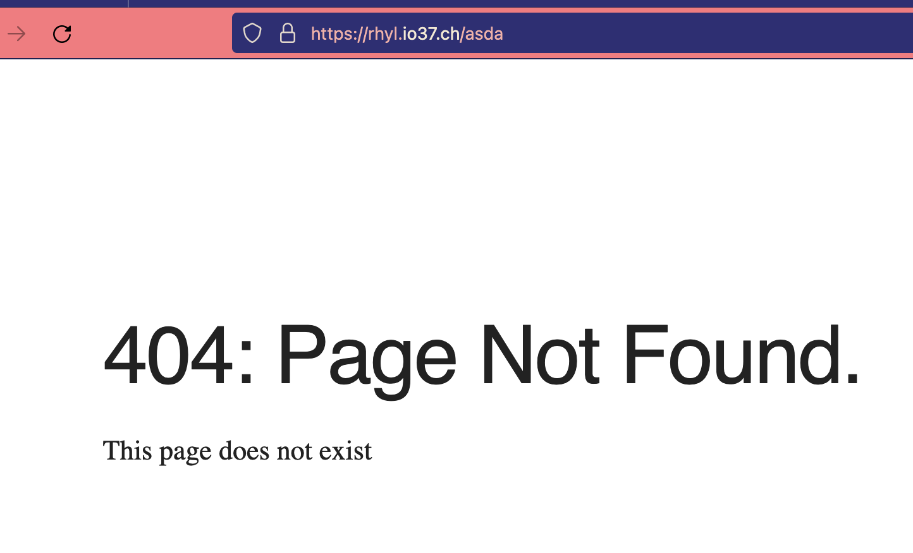

# NHINX ROLE

## What it does

* Allows nginx through ufw firewall
* Changes ownership of www directory to deploy user
* Creates custom 403, 404, and 503 pages
* Configures nginx.conf to use custom error pages

## How To Use

```bash
$ make nginx
```

Is also run automatically by `make debian`

Only runs on targets in the debian group, detailed here in the main setup.yml

<pre>
- name: Setup debian machines
  hosts: [debian]
  roles:
    - { role: install, tags: debian }
    - { role: terminal, tags: debian }
    - { role: functions, tags: debian }
 <b>- { role: nginx, tags: [debian, nginx] }</b>
</pre>

## Example run

```bash
make nginx
$(python3 -m site --user-base)/bin/ansible-playbook setup.yml -i hosts --tags "nginx"

PLAY [Before everything] **************************************************************************************************************

PLAY [Setup debian machines] **********************************************************************************************************

TASK [Gathering Facts] ****************************************************************************************************************
ok: [rhyl.io37.ch]

TASK [nginx : Allow all access to nginx http/s] ***************************************************************************************
changed: [rhyl.io37.ch] => (item=Nginx HTTP)
changed: [rhyl.io37.ch] => (item=Nginx Full)

TASK [nginx : Ownership of www and nginx to deploy user] ******************************************************************************
changed: [rhyl.io37.ch] => (item=/var/www/html)
changed: [rhyl.io37.ch] => (item=/etc/nginx/conf.d)

TASK [nginx : Copy nginx html to act as 404 for unconfigured urls] ********************************************************************
changed: [rhyl.io37.ch]

TASK [nginx : copy 403, 404, and 503 error pages to /usr/share/nginx/html] ************************************************************
changed: [rhyl.io37.ch] => (item=nginx/403.html)
changed: [rhyl.io37.ch] => (item=nginx/404.html)
changed: [rhyl.io37.ch] => (item=nginx/503.html)

TASK [nginx : copy custom errors.conf to nginx snippets conf] *************************************************************************
changed: [rhyl.io37.ch]
```

# Results

A 404 page is shown for your URL.



# Next STEPS

To prepare and cerify a site to go here, we need to run `make newsite`, and you can read more about that [here](/docs/newsite.md)
